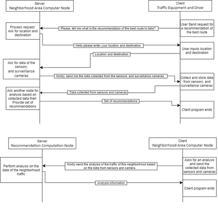
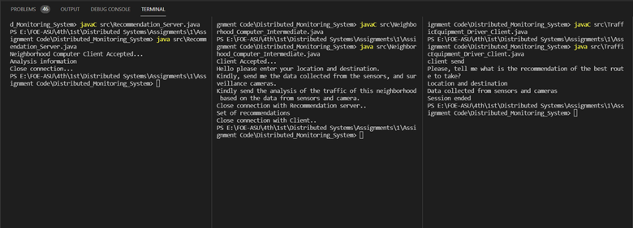
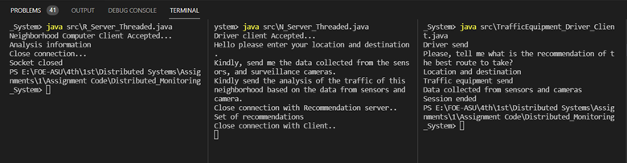

# Distributed-Monitoring-System

  
  

# Introduction
This is an individual assignment, where we assume that we have a distributed monitoring system that 
is used in a mega-city to control traffic in the streets. It consists of a set of sensors, surveillance 
cameras, electronic traffic signs, in addition to a set of computers each of them is responsible for an 
area in the city. It has also a set of servers that collect the requests from the computers and process 
them based on a global view of the traffic in the whole city. These servers provide the reply in terms 
of a set of recommendations to the computers, where they, in turn, send these recommendations to 
the drivers in the streets. The recommendations mainly provide guidelines for the state of the 
different streets in the city and the best route for the driver to reach a specific point in the city.

# About System
## Nodes:
1. Traffic equipment and driver nodes
2. Neighborhood area computer nodes
3. Recommendation computation nodes

## Mobile Agents Roles:
Role of mobile agents collect the data from sensors, surveillance cameras, and electronic traffic signs for
the traffic equipment and driver node, then transfer the data to the neighborhood area computer node.
At the neighborhood area computer node, the mobile agents process the requests from computers and 
send the collected data from traffic equipment to recommendation computation node.
At the recommendation computation node, they perform analysis on the data received then transfer
that analysis to the neighborhood area computer node.
And at the neighborhood area computer node the mobile agents provide a set of recommendations
based on the analysis data and send them to the driver.

## ALP Design

  

# Sample Results
for code

  

for threaded code

  

